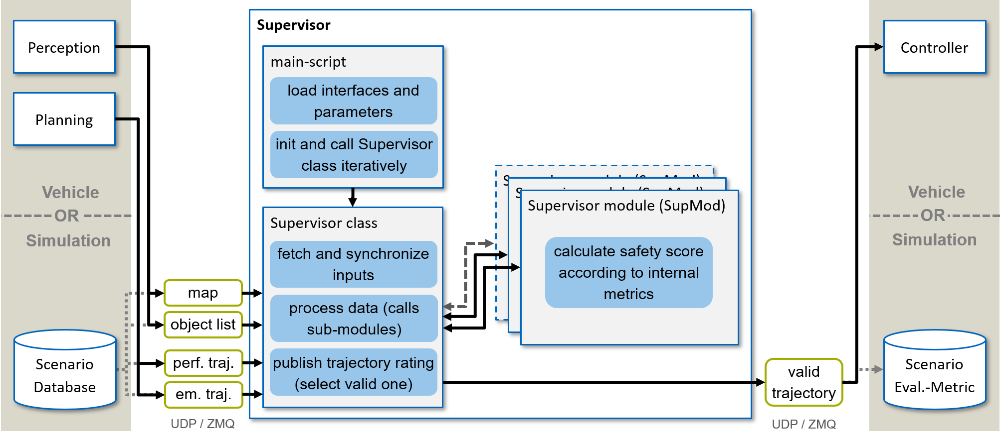

======
Basics
======

Framework
=========

*Figure 1: Structure of the Module.*

Main script
===========
As stated in the :doc:`../start/overview` online verification is started via the main script
'`main_supervisor.py`'. This loads the data for relevant UDP & ZMQ interfaces (more on this in the :doc:`config`
documentation) and initializes the Supervisor class ('`supervisor.py`' - more details about the implementation in
:doc:`../trajectory_supervisor/modules`).

Supervisor class
================
The Supervisor class sets up required class variables, Supervisor modules (SupMod) (more details in
:doc:`supmod_structure`) initialization. Once the Supervisor is initialized three key
functions have to be called in an iterative manner:

- '`set_environment()`' - set the environment specific data (map and track specific performance limits)
- '`init_supmods()`' - initialize the SupMods
- '`set_inputs()`' - get latest data
- '`process_data()`' - calculate a safety score, returns trajectory dicts with embedded safety scores

  - alternative: '`process_data_simple()`' - calculate a safety score but do only return safety scores

- '`get_safe_trajectory()`' - return a safe trajectory candidate based on the preceding safety rating
- '`get_fired_modules()`' - return list of strings for the modules fired in the preceding processing step
- '`log()`' - log information generated in respective iteration to file

Details about these functions are given below.

set_environment()
-----------------
This function is used to define environment-specific data. This includes the left and right band as well as the
acceleration limits (da. routes and weather-dependent).

The method expects the following inputs:
    - Coordinates of the left boundary (`bound_left`)
    - Coordinates of the right boundary (`bound_right`)
    - Acceleration profile for the machine used in the vehicles (`ax_max_machines`)
    - Track specific (friction) acceleration limits (`localgg`)

The format of each of these is described in the following. The boundaries are each defined as a numpy array with the
x and y coordinate in a dedicated column of the array.

.. code-block:: python

    # exemplary short boundary segment parallel to the x-axis

    y = [10.0, 10.0, 10.0]

    bound = np.column_stack((x, y))

The acceleration profile of the machine used in the vehicles. Since the remaining acceleration potential decreases with
higher velocities, the profile is provided as two columns - velocity and acceleration. The algorithm then extracts the
applicable acceleration via linear interpolation based on actual velocity and given velocity states.

.. code-block:: python

    # exemplary velocity and acceleration pairs (in this example: vehicle capable of accelerating 6.0m/s2 till 36.0m/s)
    v = [0.0, 36.0, 48.0, 72.0]
    a = [6.0, 6.0, 4.8, 2.5]

    ax_max_machines = np.column_stack((v, a))

The track specific acceleration limits are provided as numpy array capable of hosting coordinate specific acceleration
limits. However, currently only the worst case assumption (maximum acceleration on a track) is used for other vehicles.
Therefore, the other columns can remain at '0.0', resulting in the following setup.

.. code-block:: python

    # exemplary maximum acceleration limits of 13.0 m/s2 in lateral and longitudinal direction
    ax_max = 13.0
    ay_max = 13.0

    ax_max_machines = np.column_stack((0.0, 0.0, 0.0, ax_max, ay_max))

.. hint:: The definition of these specifics must be performed at least once at the start and can also be performed again
    online. However, it should be noted that the Supervisor modules may have to be reinitialized, which can take some
    computing time.

init_supmods()
--------------
The function **'`init_supmods()`'** initializes the SupMods activated in the configuration. Required data (such as
track details or vehicle information) are forwarded to the modules.

set_inputs()
------------
The class method **'`set_inputs()`'** allows to specify the latest data regarding ego-vehicle and environment. The data
(i.e. ego trajectories and object list) can either stem from an automated vehicle itself (live operation) or from a
scenario file.

This method expects the following inputs:
    - Performance trajectory (`traj_perf`)
    - Emergency trajectory (`traj_em`)
    - Object list (`objects`)

The format of each of these is described in the following. The trajectories are each defined as a dict composed as
follows:

.. code-block:: python

    traj = {'traj':  np.column_stack((s, x, y, head, curv, vel, acc)),  # numpy array each row a state
            'id':    10,                                                # unique id of the trajectory (int)
            'time':  time.time()                                        # time stamp of the trajectory in seconds
           }

The object list is a dict with each entry specifying an object with given id as key:

.. code-block:: python

    object_list = {'veh1': {'time': time.time(),        # time stamp of the object pose in seconds
                            'type': 'car',              # object type (currently only "car"s considered
                            'form': 'rectangle',        # object shape
                            'X': 100.0,                 # x-coordinate in meter
                            'Y': 50.0,                  # y-coordinate in meter
                            'theta': 0.1,               # heading in rad (north = 0.0)
                            'v_x': 20.0,                # velocity in meter per second
                            'length': 4.7,              # length of object in meter
                            'width': 2.8                # width of object in meter
                            }
                   }

It should be noted, that the Supervisor does only rate the provided data, a separate dedicated monitor must track /
detect communication dropouts or failures.

.. hint:: Ideally, the supervisor should be given the trajectories and objects used as a basis for planning. If this is
    not the case, the function 'sync_data' given in the helper_funcs can be used to bring trajectory and objects to a
    common time. For newer object data the trajectory is moved along according to the elapsed time. If the trajectory is
    more recent, the objects are predicted with a simple prediction (constant velocity).

A framework for Scenario generation, scenario data readout and ground-truth generation is provided on
GitHub (github.com/TUMFTM/ScenarioArchitect) and in the following paper:

.. code-block:: latex

   @inproceedings{stahl2020a,
     title = {An Open-Source Scenario Architect for Autonomous Vehicles},
     booktitle = {2020 Fifteenth International Conference on Ecological Vehicles and Renewable Energies (EVER)},
     author = {Stahl, Tim and Betz, Johannes},
     year = {2020}
   }

process_data()
--------------
The class method **'`process_data()`'** handles the processing of provided inputs. The function '`safety_rating()`' is
called, which triggers the calculation function ('`calc_score()`') of all parameterized SupMods to generate an
all-embracing safety assessment (0 = unsafe, 1 = safe). Each SupMod considers a partial aspect of the safety of the
system and evaluates it individually. The final safety assessment score is generated by a conjunction of the individual
modules.

The module returns a trajectory dict for each, the performance and emergency trajectory. The key 'valid' holds thereby
the corresponding safety rating.

.. hint:: The method '`process_data_simple()`' provides a simplified interface, that solely returns a tuple holding
    the boolean safety rating for each of the trajectories.

get_safe_trajectory()
---------------------
The class method **'`get_safe_trajectory()`'** returns a safe trajectory candidate based on the safety evaluation of the
current step (*'`process_data()`'* or *'`process_data_simple()`'* must be executed before). If one of the trajectories
is evaluated as 'unsafe', a valid emergency trajectory is used. If no valid emergency trajectory is available in the
current time step, the last valid one is used.

Caution: for this switching to a past trajectory to be guaranteed and safe, it must be guaranteed that the emergency and
performance trajectories are congruent for a corresponding time interval. This is not monitored in this implementation
and must be handled separately.

.. hint:: If no inputs are passed, the last trajectories of the previous calculation step are automatically used.
    Alternatively, any trajectories can be provided as inputs. It should be noted that a valid / safe emergency
    trajectory must be available when this function is called for the first time.

log()
-----
The class method **'`log()`'** stores a snapshot of the last *'`process_data()`'* step to file. If this
function is not called, no log will be generated - even if the config parameter for logging is flagged 'True'. However,
if this function is called with the logging flagged 'False' in the config file, still no log will be recorded.

Based on the desired log resolution, this function can be called in every iteration or only in a certain user-specified
manner (e.g. every n-th iteration or once a certain time has passed).

The logging method does not require any inputs. If desired, reference trajectories and a reference object list can be
provided. Both the internal and the reference entities will be logged. This is helpful, if the entities provided to the
Supervisor in the *'`set_inputs()`'*-method underlie some pre-processing. That way, the raw data can be logged along via
the reference parameters.

In order to allow logging, the Supervisor-class must be provided with appropriate logging parameters on initialization
(including file paths for the three logging files - data, messages and map). For details, refer to the provided example.

Log visualization
=================
The created logs can be visualized with the script **'`visualize_safety_log.py`'** provided in the 'visualization'
folder. If the script is provided with the path to one of the three generated log files as the first parameter, the
script automatically loads all data and opens the windows shown below. The corresponding command to be executed in a
shell is the following

.. code-block:: bash

    python3 visualize_safety_log.py "<path to your log file>"

Alternatively, if the logging-folder structure from the default file is used, the script will open the last recorded log
of today when executed without parameters. This is useful for example when setting a shortcut in the IDE (e.g. PyCharm).

.. hint:: On windows, a batch script can be used to facilitate log handling. If a batch script is created that opens the
    first parameter with the log viewer script, a log with the associated '*.bat' file can facilitate the visualization
    of logs. To do this, simply drag and drop any log file onto the script.

    An example template for a '*.bat' file is listed below. The paths for the Python executable and the visualization
    script must be adjusted accordingly.

    .. code-block:: batch

       @ECHO OFF
       SET "log_path=%*"
       ECHO %log_path:\=/%
       "C:\Users\<user>\AppData\Local\Programs\Python\Python37\python.exe" C:\Users\path\to\your\repo\visualization\src\visualize_safety_log.py %log_path:\=/%
       pause

    A similar implementation is also possible for Linux systems.

*Figure 2: Log visualization windows.*

If the log file was successfully loaded, the following windows will open (partially shown in *Figure 2*):

- Safety Log Visualization
- Acceleration Analysis
- Calculation Times
- Safety Parameter Inspector (not shown in *Figure 2*)

The individual windows are briefly explained in the following subsections.

Safety Log Visualization
------------------------

The **Safety Log Visualization** window (Figure 2, right) is the main window. The toggles in the upper left corner
"perf", "emerg" can be used to select which of the two trajectories (performance or emergency) should be displayed in
the lower two plots. The corresponding selected evaluation metrics are also shown/hidden accordingly. In the upper plot
strip, an overview of the entire log file is given. The three lines show the security evaluation (from top to bottom:
overall, dynamic, static). The crosses show individually occurred events. The following color coding must be observed:

- green (at the bottom): a new safety assessment has been recorded
- Blue (2nd from the bottom): an "info" message has been recorded.
- Yellow (3rd from the bottom): a "warning" message was recorded
- Red (4th from the bottom). a "Critical Warning" / "Error" has been recorded.

The corresponding message can be displayed when hovering the mouse cursor over it (shown here for an info message).

By hovering the mouse pointer over the upper plot, the corresponding time is also loaded and displayed in all other plot
windows and the other plots in the corresponding window. Thus, the vehicles are displayed at the corresponding position
with all evaluation metrics and trajectories.

The second plot from the top Shows the details of the trajectories of the currently selected time step. The slightly
weaker / more transparent color is the trajectory that is currently not selected (in this case "emerg").

The bottom plot shows the scenario with the boundaries and all vehicles. The currently selected section can also be
opened in a separate window using the "Open Plot" button at the bottom right (e.g. useful for publications).

Occurring safety issues are highlighted in one of the plots (e.g. overlap with reachable set).

Acceleration Analysis
----------------------

In the **Acceleration Analysis** window (*Figure 2*, bottom left), the trajectory currently displayed in the *Safety
Log Visualization* window is shown with the corresponding acceleration values of the individual trajectory points.
Points exceeding the displayed limits (blue) are highlighted in orange and are also displayed in the time overview in
the main window.

If the cursor is moved in the timeline of the main window, the points of the associated trajectory are adjusted
accordingly.

Calculation Times
------------------

In the **Calculation Times** window (*Figure 2*, top left) the total calculation time of the individual iterations is
displayed in bins. Below that, the calculation times of the individual SupMods are listed. In this way, calculation
priorities can be quickly identified.

Safety Parameter Inspector
---------------------------

In the **Safety Parameter Inspector** window, the safety scores and safety metrics of selected modules are displayed
over time. The time cursor in this window always matches the selection in the main window.

