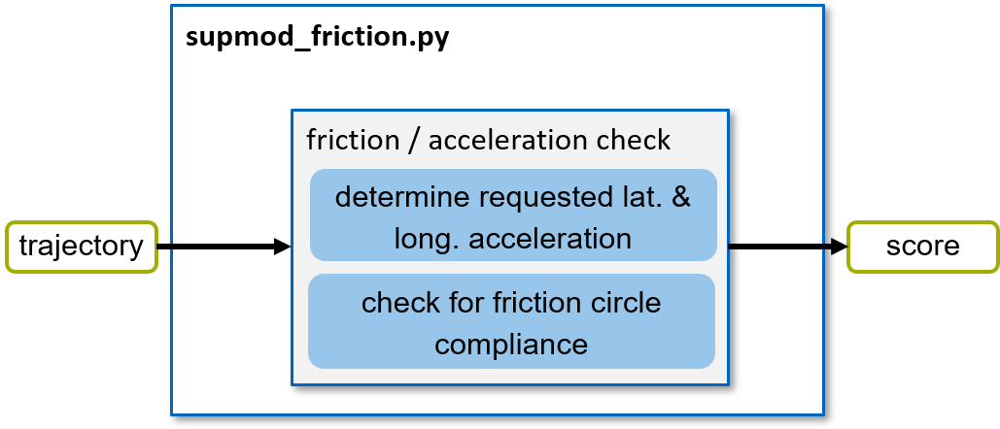
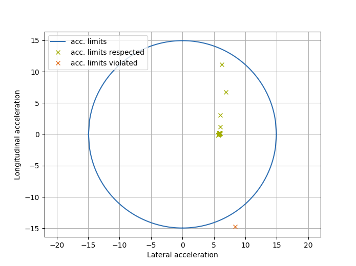

===============
SupMod Friction
===============

This is the documentation of the friction Supervisor module (SupMod). The module takes an ego-trajectory as input and
rates the safety w.r.t. given friction / acceleration limits.

Overview
========
The module (*Figure 1*) consists of a single function block (located in a separate file). Further details are given in
the following section.

*Figure 1: Structure of the supmod_friction.*

Friction check
==============
In order to check for whether the requested acceleration of the trajectory is within the friction potential of the
tire-road contact, the basic circle of forces model is used. First, the requested acceleration of the trajectory is
calculated (based on velocity and curvature). The velocity dependent drag is added to each longitudinal acceleration,
when the required parameters are specified. Then, for each sample along the trajectory, it is checked whether the
combined acceleration (longitudinal and lateral) exceed the maximum allowed / supported acceleration. Here, the circle
of forces (blue) is used (*Figure 2*). Once a single step in the trajectory (green) exceeds the circle of forces
(orange), the trajectory is rated as 'unsafe'.

*Figure 2: Visualization of the requested acceleration for samples along a trajectory.*

.. note:: In this figure an ideal friction circle is shown. A parameter dyn_model_exp can be used to configure the
    underlying shape (seamless transition between a circle [`dyn_model_exp=2.0`] and a diamond shape
    [`dyn_model_exp=1.0`]).
