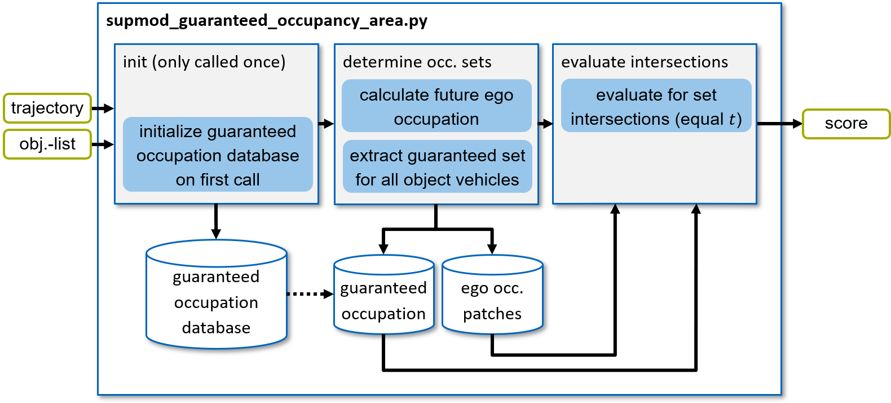

================================
SupMod Guaranteed Occupancy Area
================================

This is the documentation of the Guaranteed Occupancy Area Supervisor module (SupMod). The module takes an
ego-trajectory and a object-list as input and rates the safety w.r.t. a guaranteed collision state.

Overview
========
The basic functionality of this module is based on the following building blocks:
- Offline calculation (once on initialization) of the guaranteed occupation of a vehicle at various speed levels.
- Calculation of the occupancy states for the ego vehicle in a defined discrete time interval
- Retrieval of the guaranteed occupation for every object vehicle at the given speeds
- Evaluation if the guaranteed occupation sets intersect with the occupancy states of the ego-vehicle

The corresponding information flow scheme is visualized in *Figure 1*.

*Figure 1: Structure of the supmod_guaranteed_occupancy_area.*

Calculate occupation sets
=========================
In order to set several vehicles in relation to each other, it is first necessary to determine the occupation area of
the individual variables over time.

Pre-calculation of guaranteed occupation
----------------------------------------

.. image:: ../../../figures/guaranteed_occupation_sample.png
  :width: 600
  :alt: Example demonstrating the calculation of the guaranteed calculation set

*Figure 2: Example demonstrating the calculation of the guaranteed calculation set.*

Since the calculation of the guaranteed occupied set is computationally intensive, the calculation is performed
once when the module is initialized. For this purpose, the occupancy set is determined for a discrete
velocity- and time-steps and stored for online use.

The determination is made by starting from an initial state (velocity - 15 m/s in *Figure 2*) and executing all possible
maneuvers (light blue, *Figure 2*) in a certain quantization and discretization. For example, small angular increments
are executed from the left maximum feasible steering angle to the right maximum feasible steering angle and additionally
for all longitudinally feasible accelerations (positive and negative). For all resulting states, the occupancy by the
vehicle footprint is determined . Subsequently, the area (orange, Figure 2) occupied by all vehicle cross sections of
the corresponding time step (dark blue, *Figure 2*) can be determined for each calculated time step.

.. hint:: To understand the mechanisms and resulting sets the script
    `visualization/src/visualize_interactive_reach_occ.py` can be executed. This script allows to define any possible
    state with sliders and to view the resulting sets (see *Figure 2*).

Ego-occupation
--------------
Since the future location of the ego vehicle is defined by the planned trajectory, its occupancy can be determined by
simple evaluation. In this case, a rectangle for the vehicle footprint is determined along the trajectory in an
adjustable discrete resolution. For this purpose, the trajectory is interpolated at the desired time points of the
trajectory and the rectangle is then spanned in each case. Relevant calculations are executed in the
`get_ego_occupation()` method.

Extraction of guaranteed occupation of objects
----------------------------------------------
For each object in the object-list, the guaranteed occupation set is extracted and rotated to match the vehicle
orientation. For this purpose, the current velocity of the corresponding vehicle is used to extract the matching data
from the precomputed data. The sets represent the future states that are definitely occupied by any part of the vehicle
footprint, regardless of any physically feasible maneuver. Relevant procedures are executed in the
`get_obj_occupation()` method.

Intersection evaluation
=======================
Finally, steps of the occupancy set of the ego-vehicle that coincide in time must be checked for intersection with
the guaranteed occupation sets. If an overlap occurs in one of the time steps, the trajectory is evaluated as
unsafe (if the evaluated trajectory is followed by the ego-vehicle a collision will definitely occur). Relevant
calculations are executed in the `check_collision()` method.
