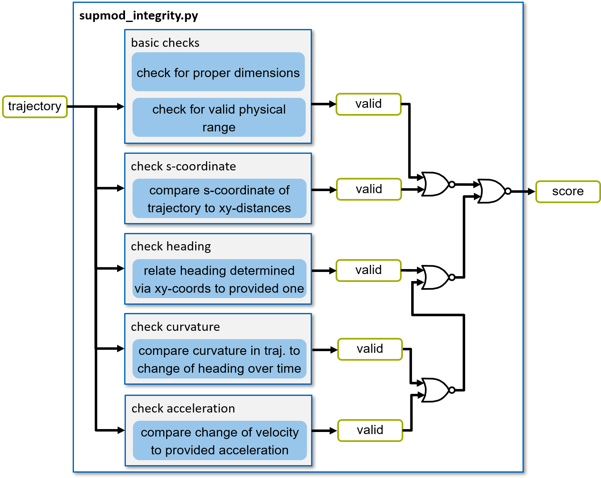

================
SupMod Integrity
================

This is the documentation of the integrity Supervisor module (SupMod). The module takes an ego-trajectory as input and
rates the data integrity within the trajectory.

Overview
========
The module (*Figure 1*) consists of several plausibility checks executed on the provided trajectory to verify the
integrity of the data. Further details on each of these checks are given in the following subsections.

*Figure 1: Structure of the supmod_integrity.*

Integrity checks
================
Within the integrity verification, several checks are executed on the input data (also envisioned in *Figure 1*):

- Basic data checks (e.g. data dimensions or valid phyiscal range)
- Check s-coordinate
- Check heading
- Check curvature
- Check acceleration

Details on the individual checks are given in the following subsections.

Basic data checks
-----------------
Basic data checks evaluate a general validity of the provided trajectory. In this spirit, the following checks are
executed:

- Data shape: evaluate whether the trajectory holds the proper amount of columns (in this case seven [s, x, y, heading,
  curvature, velocity, acceleration])
- s-coordinate in valid range: evaluate whether the s-coordinate faces untypical large jumps (e.g. two coordinates
  should not lie more than 30m apart) or negative s-coordinate
  gradients
- Heading in valid range: evaluate whether the heading is in a specified range (e.g. [-2pi, 2pi])
- Curvature in valid range: evaluate whether the curvature is in a specified range (e.g. [-1.0, 1.0] if no turns with a
  radius below 1m are expected
- Velocity in valid range: evaluate whether the velocity is in a specified range (e.g. [0.0, 100.0] if no reversing and
  no speeds above 100m/s are allowed)
- Acceleration in valid range: evaluate whether the acceleration is in a specified range (e.g. [-50.0, 50.0] if no
  acceleration above 50m/s2 is physically feasible)

 All the limits for these checks are configurable via the *supmod_config.ini*

Check s-coordinate
------------------
To verify the s-coordinate, the Euclidean distances between the x-y coordinates of the trajectory are summed and matched
to any given point. The percentage deviation must not exceed a value specified in the *supmod_conig.ini*.

.. hint:: It should be noted that the s-coordinate can follow a larger path, since an arc length along the curve is
          specified here. The approximation via the series of straight lines along the discrete coordinates thus
          underestimates the s-coordinate.

Check heading
-------------
To verify the heading, the orientation between the x-y coordinates of the trajectory is evaluated and set into relation
of the specified heading. The absolute deviation must not exceed a value specified in the *supmod_conig.ini*.

.. hint:: It should be noted that the heading given by the coordinates is only a rough estimate, since only discrete
          points along the trajectory can be evaluated. Accordingly, a large enough deviation should be allowed.

          Furthermore, the first and the last value cannot be evaluated, since the history and future are not known.

Check curvature
---------------
To verify the curvature, the change of the heading specified in the trajectory over distance (via the s-coordinate in
the trajectory) is compared to the embedded curvature values. The absolute deviation must not exceed a value specified
in the *supmod_conig.ini*.

.. hint:: It should be noted that the curvature given by the heading change is only a rough estimate, since only
          discrete instances of the heading can be evaluated. Accordingly, a large enough deviation should be allowed.

          Furthermore, the first and the last value cannot be evaluated, since the history and future are not known.

Check acceleration
------------------
To verify the acceleration, the change of the velocity specified in the trajectory over distance (via the s-coordinate
in the trajectory) is compared to the embedded acceleration values. The absolute deviation must not exceed a value
specified in the *supmod_conig.ini*.

.. hint:: It should be noted that the acceleration given by the velocity change is only a rough estimate, since only
          discrete instances of the heading can be evaluated. Accordingly, a large enough deviation should be allowed.

          Furthermore, the first and the last value cannot be evaluated, since the history and future are not known.
          Also regions where the distance between two xy-coordinates (an correspondingly the progress in s-coordinate)
          is relatively small, are excluded from the check, since this would lead to an division by zero.
