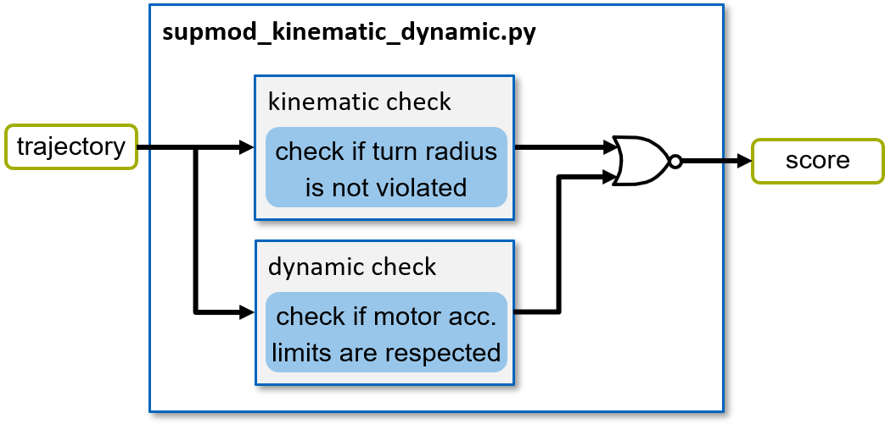

========================
SupMod Kinematic Dynamic
========================

This is the documentation of the kinematic / dynamic Supervisor module (SupMod). The module takes an ego-trajectory as
input and rates the safety w.r.t. the kinematic and dynamic properties of the ego vehicle.

Overview
========
The module (*Figure 1*) consists of two function blocks (all implemented in the main file). Further details are
given in the following sections.

*Figure 1: Structure of the supmod_kinematic_dynamic.*

Kinematic Driveability
======================
In order to check for whether the provided trajectory can be driven from the vehicle's kinematic
capabilities alone, it is checked, whether the turn radius of the vehicle is always respected in the planned trajectory.
Therefore, the reciprocal of the trajectory's curvature may not exceed the specified turn radius.

Dynamic Driveability
====================
In order to check for whether the provided trajectory can be driven from the vehicle's dynamic
capabilities alone, it is checked, whether the requested acceleration values in the planned trajectory do not violate
the motor limitations (provided via ax_max_machines). The limits are given for certain velocity intervals.
