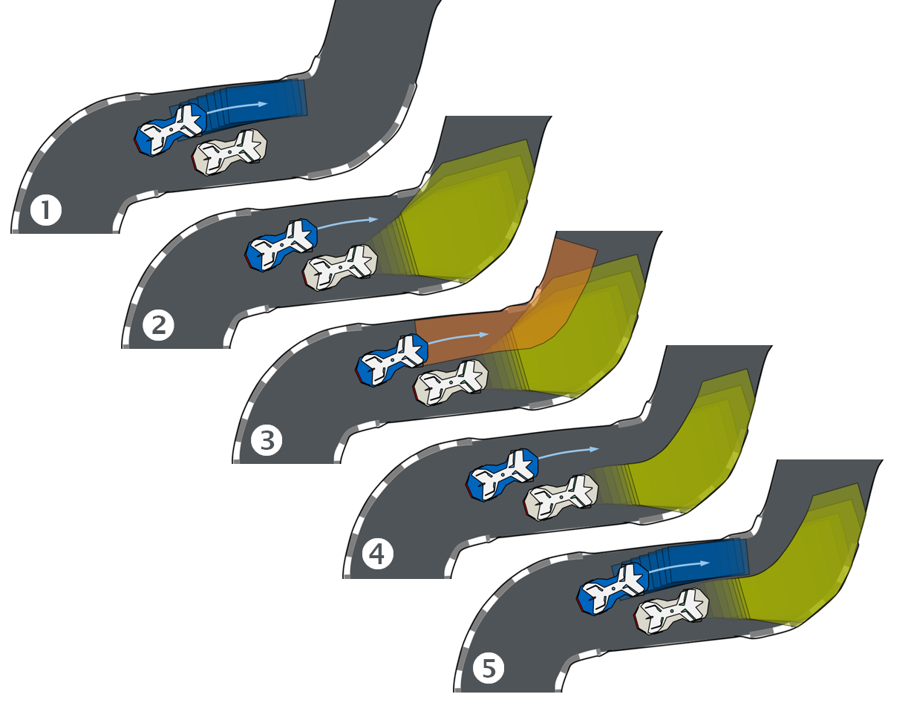
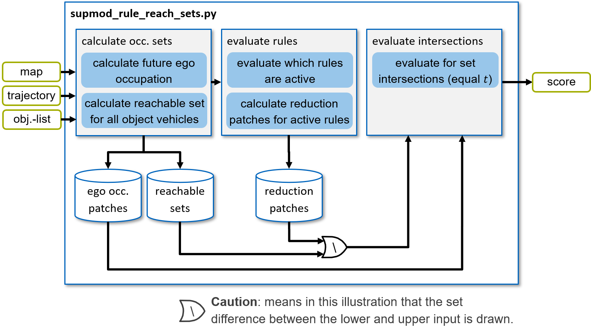

======================
SupMod Rule Reach Sets
======================

This is the documentation of the Rule Reach Sets Supervisor module (SupMod). The module takes an ego-trajectory, a map,
and a object-list as input and rates the safety w.r.t. possible collision states that are within the rule-conform
behavior of other agents.

Overview
========
The basic functionality of this module is based on the following building blocks:
- Calculation of the occupancy states for the ego vehicle in a defined discrete time interval (*Figure 1, 1*)
- Calculation of the reachable set for all vehicles in the planning horizon (here, different methods with different
  degrees of accuracy / computational effort can be selected) (*Figure 1, 2*)
- Evaluation of rules and generation of corresponding deletion patches for active rules (*Figure 1, 3*)
- Subtraction of the deletion patches from the reachable sets (*Figure 1, 4*)
- Evaluation if the rule-based reachable sets intersect with the occupancy states of the ego-vehicle (*Figure 1, 5*)

The listed key steps are sketched in *Figure 1*.

*Figure 1: Key steps of the supmod_rule_reach_sets functionality.*

The corresponding information flow scheme is visualized in *Figure 2*.

*Figure 2: Structure of the supmod_rule_reach_sets.*

Calculate occupation sets
=========================
In order to set several vehicles in relation to each other, it is first necessary to determine the occupation area of
the individual variables over time.

Ego-occupation
--------------
Since the future location of the ego vehicle is defined by the planned trajectory, its occupancy can be determined by
simple evaluation. In this case, a rectangle for the vehicle footprint is determined along the trajectory in an
adjustable discrete resolution. For this purpose, the trajectory is interpolated at the desired time points of the
trajectory and the rectangle is then spanned in each case. Relevant calculations are executed in the
`get_ego_occupation()` method.

This principle is sketched in *Figure 1, 1* - for an exemplary time interval in the future, e.g. t in [1.0s, 2.6s] with
an increment of 0.2s.

Reachable sets of objects
-------------------------
Since the future of the object vehicles is unknown for the ego vehicle, the most valid assumption possible must be made
here. The reachable sets represent all physically possible states in the future.

This principle is sketched in *Figure 1, 2* - for an exemplary time interval in the future, e.g. t in [1.0s, 2.6s] with
an increment of 0.2s.

It should be noted, that multiple calculation principles are implemented for the determination of the reachable sets.
The key properties are listed below:
- simple:       reachable set based based on over-approximation introduced by Althoff et al. (see below)
- turn:         same as simple, but limited by configured turn radius to left / right from current position
- bound:        same as simple, but considering steering trajectory ensuring not to collide with walls

All three implementations are based on the basic principles of overapproximated reachable sets introduced by Althoff
et al. (M. Althoff and S. Magdici, “Set-based prediction of traffic participants on arbitrary road networks,” IEEE
Transactions on Intelligent Vehicles, 2016, doi: 10/ghfs7z.).

Rule evaluation and deletion patch generation
=============================================
Once the reachable sets have been determined, applicable rules are evaluated and valid ones are applied to the
reachable sets.

Rule evaluation
---------------
Since the reachable sets very quickly become so large that overtaking or the like would no longer be possible
without cutting the set, applicable rules are also taken into account. The remaining set then describes all
physically possible maneuvers respecting the applicable rules. If the ego vehicle intersects this set, a collision
can occur that is the fault of the ego vehicle. Any maneuvers that cannot eliminate this eventuality should be avoided.

To begin with, applicable rules of the environment are formalized and evaluated online for the current time step. For
this purpose, past-time temporal logic (ptLTL) is used. If a rule holds, a corresponding deletion patch is calculated
(see next section).

.. note:: Currently only a selected set of rules is formalized and implemented for demonstration purposes. Make sure to
    extend the set of rules to the set of applicable rules in your environment.

    Furthermore, rules are currently evaluated for the current time-stamp and projected forward in time for performance
    purposes. A proper evaluation would require to evaluate the rule along the evaluation of the reachable set with time
    variant deletion patches.

Deletion patch calculation
--------------------------
For active rules, deletion patches are calculated that have been formalized according to the rules and represent them as
well as possible.

In *Figure 1, 3*, for example, it is shown that vehicles that are partially driving side by side must not be forced off the
track. therefore, at least one vehicle width must be left. This set is shown in orange.

.. note:: Relevant calculations regarding the rules can be found in the folder `rules`. Here, each set of rules is
    implemented in a dedicated Python file. In our case this is shown for Roborace Season Alpha and F1 rules. For
    further details, please refer to the paper referenced on the top level of this documentation.

Set subtraction
===============
In this step, the calculated erasure patches are subtracted from the reachable sets. This is done for each
discretized time step of the reachable sets. If the erasure patch is valid over all time steps, it is subtracted in
each time step. Alternatively, different realizations of the erasure patch can be subtracted for each time step of the
reachable set. Relevant calculations are executed in the `reduce_reach_set()` method.

The resulting reachable set for the example shown here is shown in *Figure 1, 4*.

Intersection evaluation
=======================
Finally, steps of the occupancy set of the ego-vehicle that coincide in time must be checked for intersection with
the rule-based reachable sets. If an overlap occurs in one of the time steps, the trajectory is evaluated as
unsafe / risky. Relevant calculations are executed in the `check_collision()` method.
