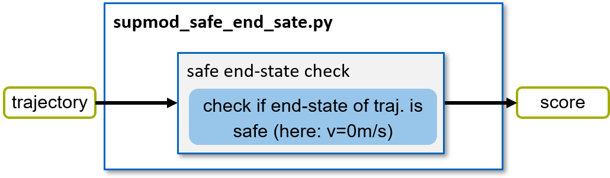

=====================
SupMod Safe End State
=====================

This is the documentation of the safe end state Supervisor module (SupMod). The module takes an ego-trajectory as input
and rates the safety w.r.t. a safe end state.

Overview
========
The module (*Figure 1*) consists of a single function block (all implemented in the main file). Further details are
given in the following section.

*Figure 1: Structure of the supmod_safe_end_state.*

End-state check
===============
In order to check for whether the provided trajectory results  in a safe end-state, it is checked, whether the last
point in the trajectory is stationary. Further restrictions like position on track, valid acceleration profile, etc. are
ensured by the other submodules (see above).

.. warning:: Currently, any stationary state on the track is rated as safe. In some situations (e.g. real race or
    highway), such states may not be rated as 'safe'. However, any function rating the safety of the end-state may be
    introduced here.
