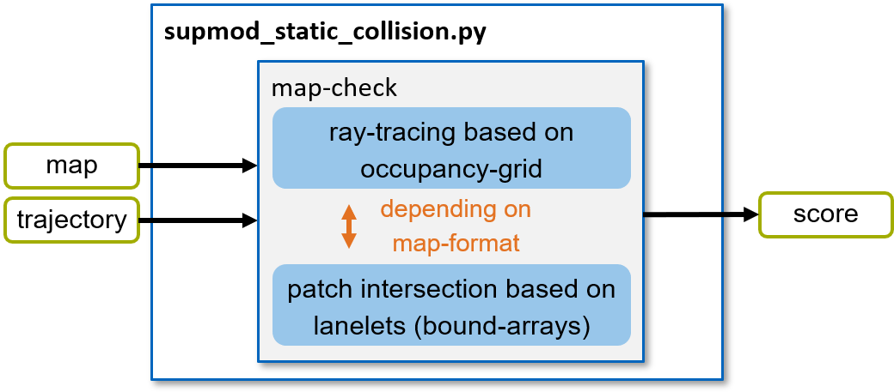
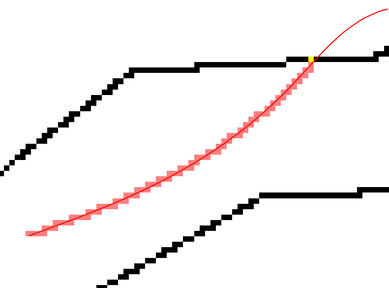

=======================
SupMod Static Collision
=======================

This is the documentation of the static collision Supervisor module (SupMod). The module takes an ego-trajectory and a
map representation as input and rates the safety w.r.t. a collision with the static environment (e.g. track boundaries).

Overview
========
The module (*Figure 1*) consists of two alternative function blocks (split into separate files), each handling one
map representation. Further details on each of these two are given in the following subsections.

*Figure 1: Structure of the supmod_static_collision.*

Map check
=========
Within the map check, the ego-trajectory is checked for compliance with the static environment. The module can handle
two types of map-formats:

- Map based on an occupancy-grid
- Map defined by lanelets (coordinate arrays for the bounds)

Depending on the provided map-format, an appropriate algorithm is executed. Details are given in the following
subsections.

Occupancy-grid map
------------------
An occupancy-grid is a representation of the environment as an evenly spaced field of binary random variables each
representing the presence of an obstacle / bound at that location in the environment.

Within the algorithm, the occupancy-map provided in form of a dictionary with the following entries:

- grid:           occupancy grid (np-array) holding '1' for occupied and '0' for unoccupied cells
- origin:         x, y coordinates of the origin (0, 0) in the occupancy grid
- resolution:     grid resolution in meters

In order to check for collisions between the ego-trajectory and the occupancy gird, all cells passed by the trajectory
have to be identified. For this purpose, ray-tracing is used to detect all passed cells. An exemplary situation is given
in *Figure 2*. Here, all cells crossed by the trajectory (red) are identified by the algorithm. Once a crossed cell is
occupied by the bound (black), a collision is detected (yellow cell).

*Figure 2: Visualization of the ray-tracing result with a detected collision.*

.. hint:: The chosen resolution of the occupancy-grid is crucial here! If chosen to large, the algorithm might detect
    collisions, even if there is enough space left. If chosen to small, the calculation time increases drastically.

Lanelet map
-----------
A lanelet map representation describes the bounds of a track or lane in form of sequences of coordinates. In our
algorithm (race-environment), this is restricted to the left and right bound.

In order to check for collisions of the ego-trajectory with one of the bounds, the python library 'shapely' is used. In
that favor, the trajectory and the bounds are converted to patches, where the ego-trajectory is inflated by the width of
the vehicle. Afterwards, these patches are checked for intersection. Once a intersection is detected, the trajectory is
rated as 'unsafe' due to an upcoming collision with one of the bounds.
