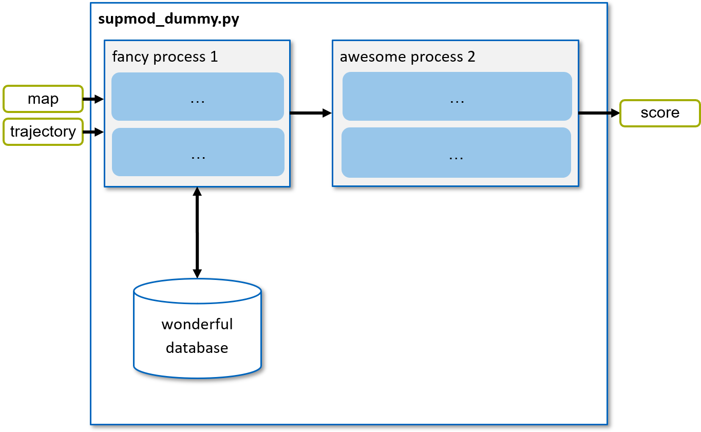

============
SupMod Dummy
============

This is the documentation of the dummy Supervisor module (SupMod). The dummy module takes an arbitrary input and always
returns 'True'. This module serves as simple example, demonstrating the interaction with modules and providing a code
skeleton.

Overview
========
Since the architecture for this process would be too simple, the following framework illustrates a random signal flow.
Further added modules would benefit from a documentation text accompanied with a framework visualization in
a similar style to *Figure 1*.

*Figure 1: Structure of the supmod_dummy.*

This figure was created with PowerPoint. In order to adapt the scheme, you are free to use the template-slides in this
repository ('`/docs/source/figures/module_schemes.pptx`'). When drawing your framework scheme, simply add a new slide to
this file.

Add your module documentation
=============================
In order to add a dedicated page for your SupMod, add a '<supmod_your_module>.rst'-file with your module name in the
following folder: '/docs/source/software/content/supervisor_modules'.

The documentation files are written in a markup language called reStructuredText (reST), further formatting insights
can be found `here <https://www.sphinx-doc.org/en/master/usage/restructuredtext/index.html>`_.
