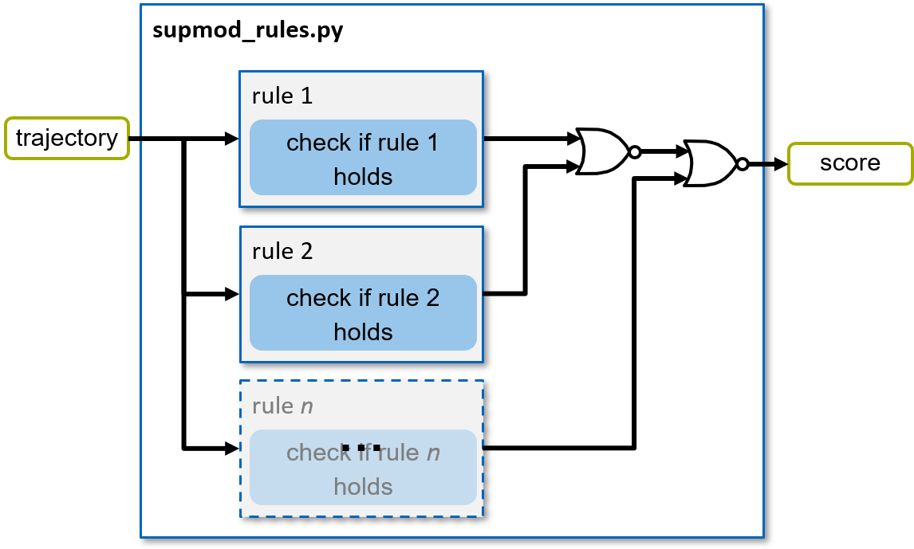

============
SupMod Rules
============

This is the documentation of the rule Supervisor module (SupMod). The module takes an ego-trajectory as input
and rates the safety w.r.t. applicable rules in a static environment.

Overview
========
The module (*Figure 1*) consists of a a number of rules (all implemented in the main file). Further details are
given in the following section.

*Figure 1: Structure of the supmod_rules.*

Rules
=====
In order to check for whether the provided trajectory is rule conform, it is checked, whether all formalized rules
in this module hold. Currently, the following illustrative rules are implemented:
    - Adherence to maximum velocity defined per event / by race control
    - Exclusion of backward movements (negative velocities)
    - Adherence to maximum braking deceleration (specified by event / race control)

.. warning:: Currently, only an exemplary number of rules have been implemented. The formalization of further rules must
    be investigated depending on the application. In addition, only rules in the static environment are reviewed here.
    Collisions (caused by the ego-vehicle) with other road users are handled via the other SupMods. This satisfies the
    safety objective supported here (avoidance of self-caused collisions). However, if the Supervisor is still to
    guarantee compliance with the rules of the trajectory planner, the dynamic environment must also be included.

