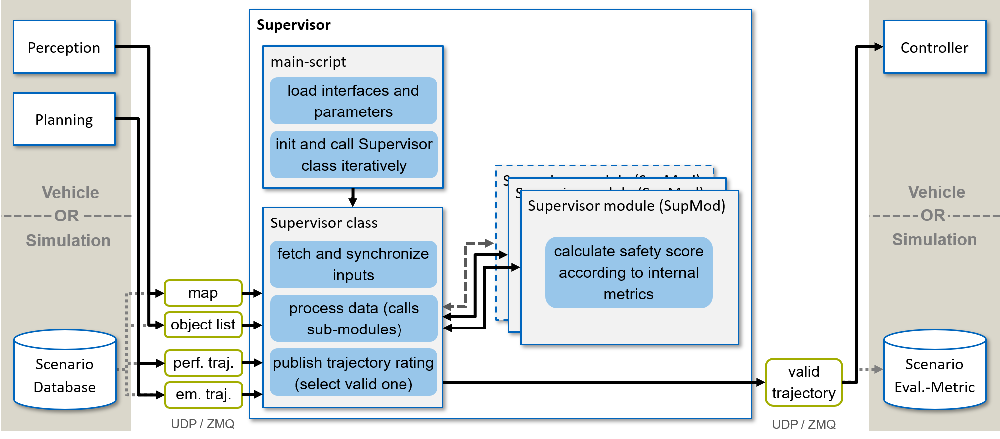

===================
Repository Overview
===================

Folder structure
================
The repository is composed of different components. Each of them is contained in a sub-folder.

+-----------------------+--------------------------------------------------------------------------+
| Folder                | Description                                                              |
+=======================+==========================================================================+
| CI                    | This folder holds relevant files for CI jobs (scripts and scenarios).    |
+-----------------------+--------------------------------------------------------------------------+
| params                | This folder holds parameter files, specifying the behavior and           |
|                       |                                                                          |
|                       | interfaces of the module.                                                |
+-----------------------+--------------------------------------------------------------------------+
| sample_files          | This contains sample scenarios to be executed in the example scripts.    |
+-----------------------+--------------------------------------------------------------------------+
| trajectory_supervisor | This folder is a python module holding the core class and functions      |
|                       |                                                                          |
|                       | of the online verification code.                                         |
+-----------------------+--------------------------------------------------------------------------+

The trajectory supervisor folder holds the core functionality and hosts the following subfolders.

+-------------------+--------------------------------------------------------------------------+
| Folder            | Description                                                              |
+===================+==========================================================================+
| helper_funcs      | This folder is a python module holding supporting methods used in one    |
|                   |                                                                          |
|                   | or multiple other functions.                                             |
+-------------------+--------------------------------------------------------------------------+
| supervisor        | This folder is a python module holding the core class and functions      |
|                   |                                                                          |
|                   | of the online verification code.                                         |
+-------------------+--------------------------------------------------------------------------+
| supervisor_modules| This folder holds modules used in the overall safety Supervisor.         |
|                   |                                                                          |
|                   | Each module calculates and returns an individual safety score.           |
+-------------------+--------------------------------------------------------------------------+
| visualization     | This folder holds files that allow visualization of online verification  |
|                   |                                                                          |
|                   | logs, as well as visualization of other related aspects.                 |
+-------------------+--------------------------------------------------------------------------+

In the root folder is the `main_supervisor.py`-file located. This python script establishes all required interfaces and
executes the online verification framework.

Framework
=========

*Figure 1: Structure of the Module.*

This repo provides functions for online verification of the planning module on an automated vehicle.
In the following, the rough structure of the repository is explained (see Figure 1). For the examples in this repo, we
pipe the data from the scenarios directly to the Supervisor. The figure depicts an possible realization on a real
vehicle with corresponding Ethernet interfaces (ZMQ / UDP).

The online verification is started via the main-script '`main_supervisor.py`'. This loads the data for relevant UDP &
ZMQ interfaces (more on this later) and initializes the Supervisor class ('`class_supervisor.py`').

The Supervisor class sets up required class variables and Supervisor Modules (SupMod) upon
initialization. The class method '`set_inputs()`' retrieves the latest data regarding ego-vehicle and
environment. The data can either stem from the automated vehicle itself (live operation) or from a scenario file.

The class method '`process_data()`' calls the calculation function of all parameterized SupMods to generate an
all-embracing safety assessment (0 = unsafe, 1 = safe). Each SupMod considers a partial aspect of the safety of the
system and evaluates it individually. The final safety assessment is generated by a conjunction of the individual
modules and returned. The transmitted safety assessment can then be used in the vehicle or evaluated by a scenario
evaluation.
